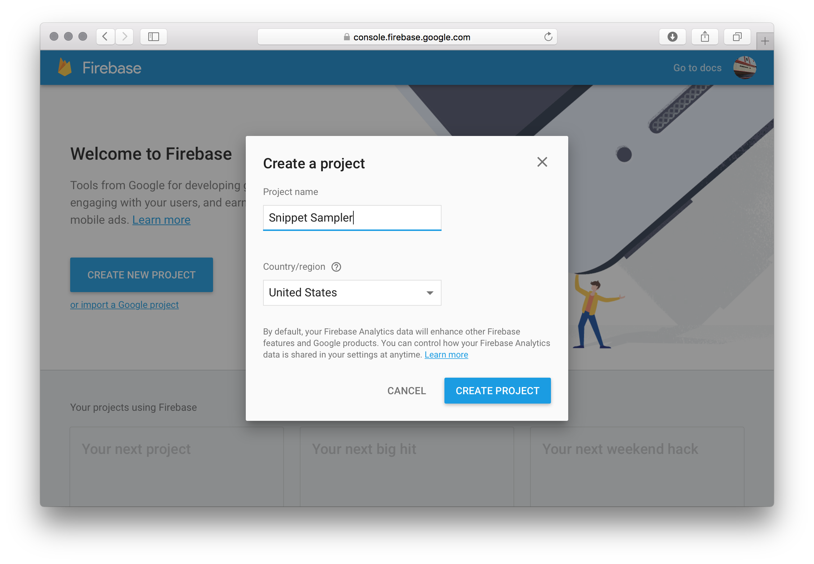
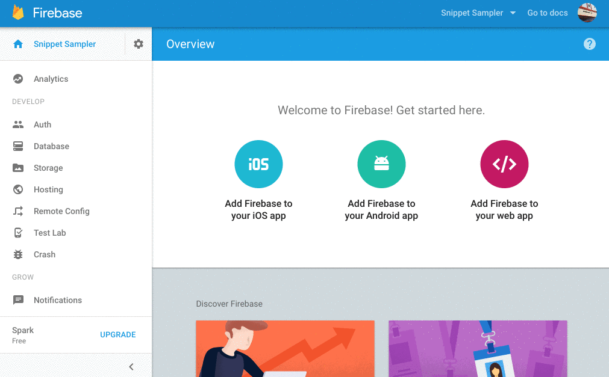
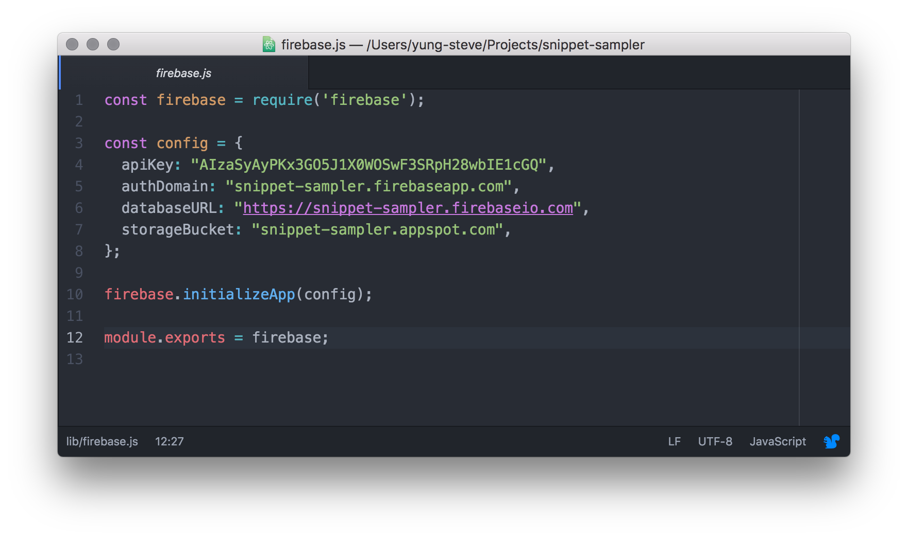

# Snippet Sampler

## Getting Started

First and foremost, let's make a directory.

```
mkdir snippet-sampler
```

Treat yourself to some sweet, sweet `cd` action and head on into that directory.

```
cd snippet-sampler
```

Alright, now let's get a `package.json` in place.

```
npm init --yes
```

We'll probably want some dependencies too.

```
npm install -D firebase firebase-tools jquery webpack webpack-dev-server escape-html
```

Cool. We're not done setting up just yet.

```
touch webpack.config.js
mkdir public lib
touch public/index.html public/style.css lib/index.js
```

We'll use a super simple webpack configuration.

```js
const path = require('path');

module.exports = {
  entry: './lib/index.js',
  output: {
      path: path.join(__dirname, 'public'),
      publicPath: "/public/",
      filename: 'bundle.js'
  },
  devtool: 'cheap-source-map'
};
```

We'll also go ahead and add `start` and `build` scripts to `package.json`.

```js
{
  // Other properties…
  "scripts": {
    "start": "webpack-dev-server",
    "build": "webpack",
    "test": "echo \"Error: no test specified\" && exit 1"
  },
  // Other properties…
}
```

In `public/index.html`, let's add some markup.

```html
<!DOCTYPE html>
<html>
  <head>
    <meta charset="utf-8">
    <title>Snippet Sampler</title>
    <link rel="stylesheet" href="style.css">
  </head>
  <body>

    <header>
      <h1>Snippet Sampler</h1>
    </header>

    <section id="new-snippet">
      <form id="new-snippet--form">
        <input type="text" placeholder="Title" id="new-snippet--title">
        <div contenteditable id="new-snippet--code"></div>
        <input type="submit" id="new-snippet--submit" disabled>
      </form>
    </section>

    <section id="snippets"></section>

    <script src="bundle.js"></script>
  </body>
</html>
```

Let's also have give it some style.

```css
:root {
  --dark-gray: #333745;
  --hot-pink: #E63462;
  --orange: #FE5F55;
  --light-green: #C7EFCF;
  --pale-green: #EEF5DB;
}

*, html, body {
  box-sizing: border-box;
}

body {
  font: menu;
  color: var(--dark-gray);
}

header {
  text-align: center;
}

#new-snippet--title, #new-snippet--code, #new-snippet--submit {
  border: none;
  background-color: var(--pale-green);
  display: block;
  width: 100vw;
  margin-bottom: 1em;
  font-size: 1.4em;
  padding: 1em;
}

#new-snippet--code {
  font-family: monospace;
}

#new-snippet--submit {
  background-color: var(--light-green);
  border: 2px solid var(--orange);
  transition: border 0.5s;
}

#new-snippet--submit:disabled {
  border-color: var(--pale-green);
}

#snippets {
  display: flex;
  flex-wrap: wrap;
  justify-content: space-around;
}

.snippet {
  width: 300px;
  padding: 1em;
  margin-bottom: 2em;
  border: 1px solid var(--hot-pink);
}

pre {
  width: 100%;
  height: 200px;
  overflow: scroll;
  background-color: var(--pale-green);
  border: 1px solid var(--light-green);
}
```

## Configuring Firebase

Head over to https://console.firebase.google.com/ to create a new application.

Hit the big blue button that says "Create New Project."



Next, we'll need to get our hands on those sweet, sweet Firebase keys.

Go to your app, click on "Auth" in the sidebar and then click on "WEB SETUP" in the upper right-hand corner.



Create a new file called `lib/firebase.js`, we'll add the following in order to get Firebase configured and setup.

```js
const firebase = require('firebase');

// Paste the configuration you copied from the Firebase Console above here.

module.exports = firebase;
```



At this point, we have most of our setup done and we're ready to start building our application.

## Wiring Up the User interface

### Caching Selectors

Create a new file called `lib/elements.js` and add the following content.

```js
const $ = require('jquery');

const $snippetsSection = $('#snippets');
const $newSnippetForm = $('#new-snippet--form');
const $newSnippetTitle = $('#new-snippet--title');
const $newSnippetCode = $('#new-snippet--code');
const $newSnippetSubmit = $('#new-snippet--submit');

module.exports = {
  $snippetsSection,
  $newSnippetForm,
  $newSnippetTitle,
  $newSnippetCode,
  $newSnippetSubmit
};
```

### Validating the Form

Create a new file called `lib/validate-input-fields.js` and add the following content:

```js
const {
  $newSnippetTitle,
  $newSnippetCode,
  $newSnippetSubmit
} = require('./elements');

module.exports = () => {
  const bothFieldsHaveContent = $newSnippetTitle.val() && $newSnippetCode.text();
  $newSnippetSubmit.attr('disabled', !bothFieldsHaveContent);
};
```

### Rendering Snippets

Make a new file called `lib/render-snippet.js` and add the following function in order to render a code snippet as HTML.

```js
const $ = require('jquery');
const escape = require('escape-html');

module.exports = (title, code) => {
  const $snippetElement = $(`
    <article class="snippet">
      <h2 class="snippet--title">${escape(title)}</h2>
      <pre><code class="snippet--code">${escape(code)}</code></pre>
      <button>Remove</button>
    </article>
  `);

  return $snippetElement;
};
```

### A First Pass and Submitting the Form

In `lib/index.js`, we'll pull in the selectors and functions from the modules we just created:

```js
const firebase = require('./firebase');
const validateInputFields = require('./validate-input-fields');
const renderSnippet = require('./render-snippet');
const {
  $snippetsSection,
  $newSnippetForm,
  $newSnippetTitle,
  $newSnippetCode,
  $newSnippetSubmit
} = require('./elements');
```

Next we'll get check to see if the submit button should be activated in the event that both fields have content.

```js
$newSnippetTitle.on('keyup', validateInputFields);
$newSnippetCode.on('keyup', validateInputFields);
```

Finally, we'll add the event listener, which will add it to the page.

```js
$newSnippetForm.on('submit', (e) => {
  e.preventDefault();

  const title = $newSnippetTitle.val();
  const code = $newSnippetCode.text();

  $snippetsSection.append(renderSnippet(title, code));

  $newSnippetTitle.val('');
  $newSnippetCode.val('');
});
```
